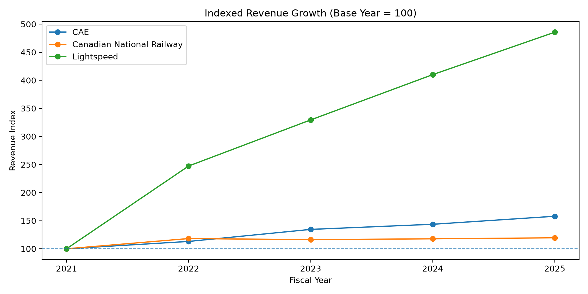
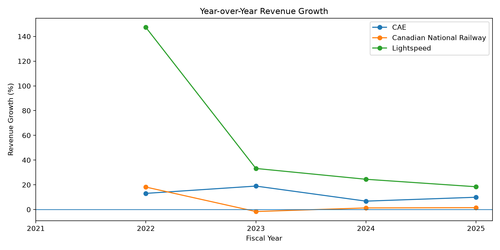
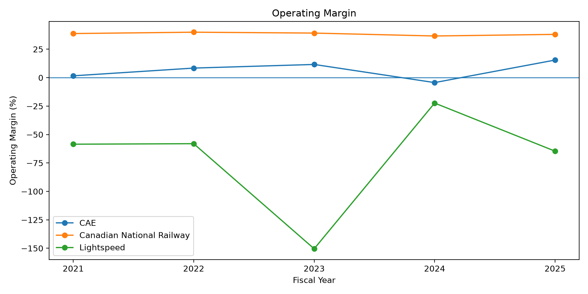
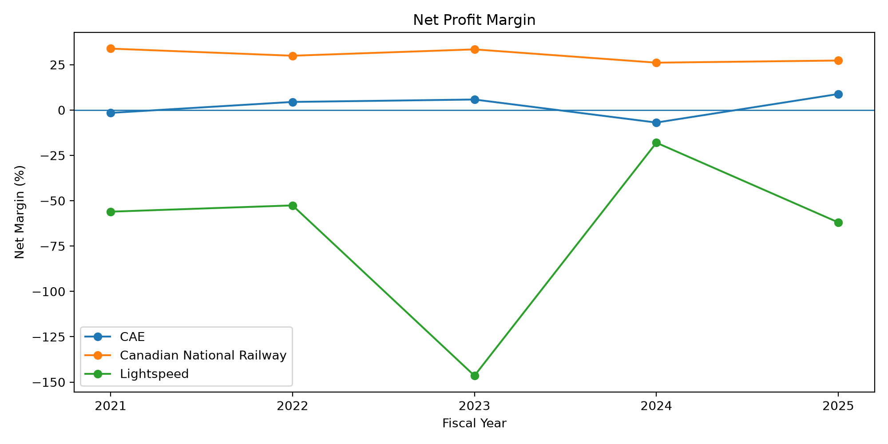
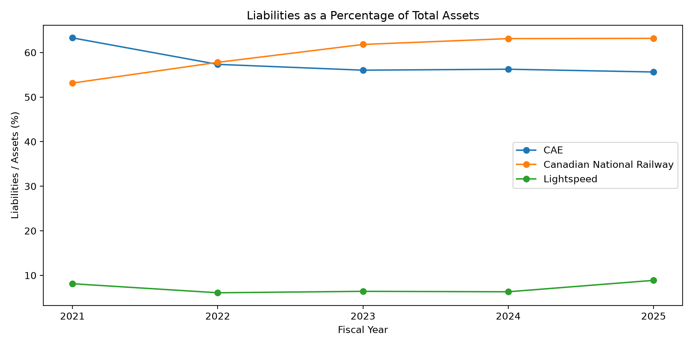
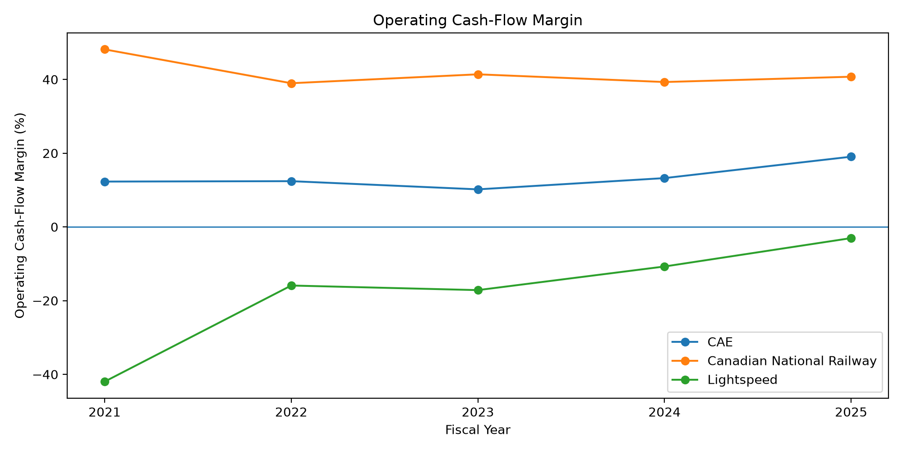
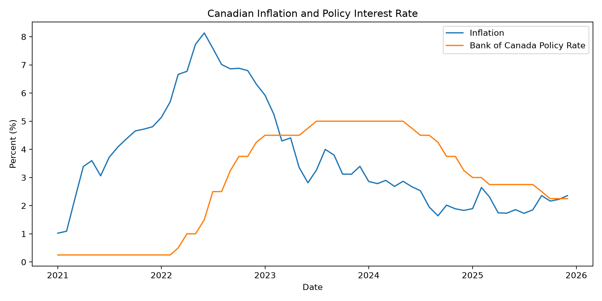

# Montreal Financial & Macro Data Explorer

A Python and SQL-based financial analysis project exploring how major Montreal-connected public companies performed from 2021–2025 while operating under changing Canadian economic conditions.

This project builds a complete financial data pipeline: collecting company financial data, storing it in SQLite, calculating performance metrics, and creating visual comparisons of growth, profitability, cash generation, and financial structure.

---

## Project Highlights

- Analyzed 3 Montreal-connected public companies across technology, transportation, and aerospace.
- Built a SQLite financial database containing company and macroeconomic data.
- Calculated financial ratios including margins, growth rates, leverage, and cash-flow performance.
- Generated automated financial visualizations using Python.

---

## Interactive Analysis

A detailed walkthrough of the financial analysis, calculations, and visualizations is available in the Jupyter notebook:

[Open Final Analysis Notebook](notebooks/final_analysis.ipynb)

---

## Research Question

How have selected Montreal-connected public companies performed financially from 2021–2025, and how do their financial profiles compare within the broader Canadian economic environment?

The analysis compares three Montreal-connected companies operating in different industries:

- Growth-oriented technology
- Transportation infrastructure
- Aerospace manufacturing

---

## Companies Analyzed

| Company | Ticker | Industry | Reporting Currency |
|---|---|---|---|
| Lightspeed Commerce | LSPD | Technology | USD |
| Canadian National Railway | CNR | Rail Transportation | CAD |
| CAE | CAE | Aerospace | CAD |

Because companies report in different currencies and operate in different industries, the analysis emphasizes normalized metrics rather than comparing raw dollar values directly.

---

## Data Sources

Financial data was collected from:

- SEC XBRL Company Facts API
- Company annual financial statements where supplemental information was required

Macroeconomic data was collected from Canadian economic sources:

- Consumer Price Index (CPI)
- Inflation rate
- Bank of Canada policy rate

---

## Technology Stack

### Programming

- Python
- pandas
- requests
- matplotlib

### Database

- SQLite
- SQL queries
- Relational database design

### Analysis

- Financial ratio calculations
- Time-series analysis
- Data validation
- Reproducible reporting

---

## Project Pipeline

```
Financial APIs / Annual Reports
              |
              v
       Python Data Collection
              |
              v
       Cleaned Financial Data
              |
              v
          SQLite Database
              |
              v
        SQL Data Analysis
              |
              v
      Financial Ratio Metrics
              |
              v
     Visualizations + Notebook
```

---

## Repository Structure

```
montreal-financial-data-explorer/

│
├── data/
│   ├── raw/
│   ├── processed/
│   └── financial_data.db
│
├── src/
│   ├── cn_collection.py
│   ├── cae_collection.py
│   ├── data_collection.py
│   ├── macro_collection.py
│   ├── database_setup.py
│   ├── sql_analysis.py
│   ├── metrics.py
│   └── visualization.py
│
├── notebooks/
│   └── final_analysis.ipynb
│
├── outputs/
│   └── charts/
│
└── README.md
```

---

## Financial Metrics

The project calculates:

### Revenue Growth

Measures annual revenue expansion.

### Operating Margin

Measures operating profitability relative to revenue.

### Net Profit Margin

Measures bottom-line profitability.

### Liabilities-to-Assets Ratio

Shows balance-sheet structure and financial leverage.

### Operating Cash Flow Margin

Measures the ability to generate cash from operations.

---

## Key Findings

### Revenue Growth

Lightspeed experienced the fastest revenue growth during the period, reflecting its expansion phase as a technology company. Its indexed revenue increased substantially from the 2021 baseline, although this growth came with continued operating losses.

Canadian National Railway showed slower but more stable growth, consistent with a mature infrastructure business.

CAE experienced steady expansion with more variation across years.

---

### Profitability

Canadian National Railway maintained the strongest profitability profile.

The company consistently produced high operating and net margins.

CAE showed moderate profitability with some volatility.

Lightspeed achieved strong revenue growth but remained unprofitable during the analyzed period.

---

### Cash Generation

Canadian National Railway generated the strongest operating cash-flow margins.

CAE maintained positive operating cash generation.

Lightspeed showed improving cash-flow trends but remained negative throughout the period.

---

### Balance Sheet

The three companies displayed different capital structures:

- CN operated with a higher liabilities-to-assets ratio consistent with an asset-intensive transportation business.
- CAE maintained a relatively stable leverage profile.
- Lightspeed operated with a significantly lower liabilities-to-assets ratio.

---

## Visualizations

The project generates:

- Indexed revenue growth comparison
- Revenue growth rates
- Operating margin comparison
- Net margin comparison
- Liabilities-to-assets comparison
- Operating cash-flow margin comparison
- Canadian inflation and policy-rate environment

All charts are automatically generated through Python.

---

## Project Results

The analysis produced several visual comparisons showing differences in growth, profitability, cash generation, and financial structure.

### Revenue Growth Comparison



### Revenue Growth Rates



### Operating Margin Comparison



### Net Profit Margin Comparison



### Balance Sheet Structure



### Operating Cash Flow Performance



### Canadian Macroeconomic Environment



---

## SQL Database Component

The project uses SQLite to create a structured financial database.

### Companies Table

Stores:

- Company name
- Ticker
- Industry
- Currency

### Financials Table

Stores:

- Fiscal year-end
- Revenue
- Operating income
- Net income
- Assets
- Liabilities
- Cash
- Operating cash flow

### Macro Data Table

Stores:

- CPI
- Inflation rate
- Policy interest rate

SQL queries are used to analyze and combine financial information.

---

## Running the Project

Clone the repository and install dependencies:

```bash
pip install -r requirements.txt
```

Collect company financial data:

```bash
python src/cn_collection.py
python src/cae_collection.py
python src/data_collection.py
python src/macro_collection.py
```

Build the database:

```bash
python src/database_setup.py
```

Run analysis:

```bash
python src/sql_analysis.py
```

Generate charts:

```bash
python src/visualization.py
```

Open the final notebook:

```
notebooks/final_analysis.ipynb
```

---

## Limitations

### Currency Differences

Lightspeed reports in USD while CN and CAE report in CAD.

Therefore, comparisons emphasize ratios and growth rates instead of absolute dollar values.

### Fiscal Year Differences

Companies have different fiscal year-end dates.

Annual periods do not perfectly represent identical economic conditions.

### Industry Differences

Technology, rail transportation, and aerospace have different business models and capital requirements.

Metrics should therefore be interpreted within industry context.

### Data Availability

Some SEC XBRL concepts contained gaps. Supplemental annual-report values were used where required.

---

## Future Improvements

Possible extensions include:

- Adding more Montreal-based companies
- Adding stock-market performance data
- Building an interactive dashboard using Streamlit
- Adding valuation metrics
- Automating scheduled data updates
- Adding forecasting models

---

## Author

Built as a portfolio project demonstrating:

- Financial data engineering
- Python automation
- SQL database design
- Financial analysis
- Data visualization